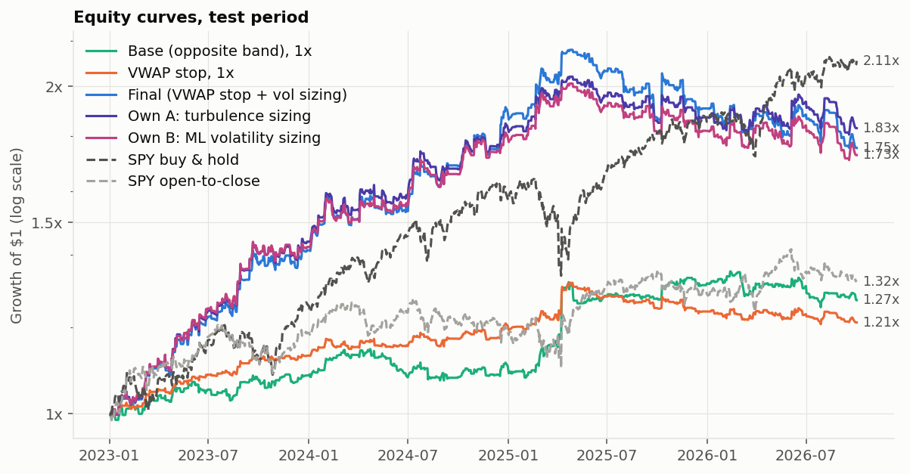
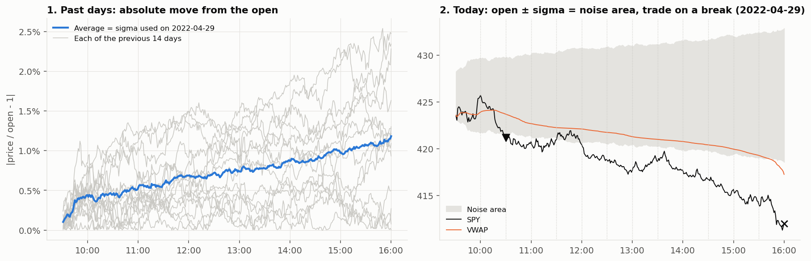
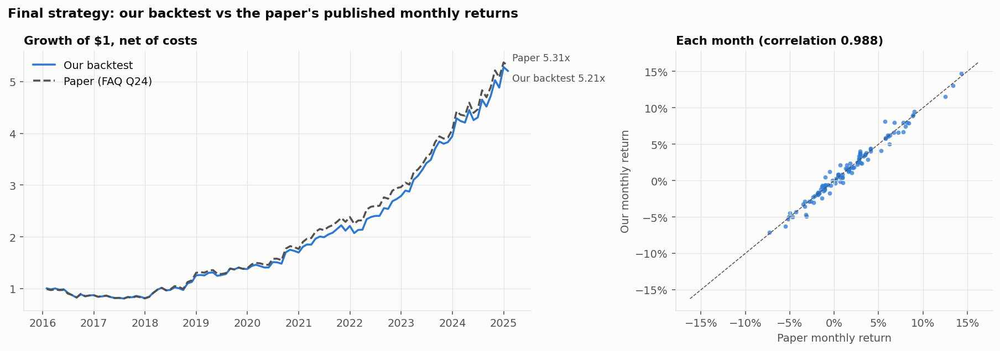

# Intraday Momentum Strategy for SPY

A replication of Zarattini, Aziz & Barbon, *Beat the Market: An Effective Intraday Momentum Strategy
for S&P500 ETF (SPY)*, built from raw SPY 1-minute bars (January 2016 – October 2026), plus an own
extension that sizes each trade by how turbulent the day has been so far.

The project asks three questions:

1. **Can the paper's results be reproduced?** Yes: our monthly returns track the paper's published
   ones with a correlation of 0.988.
2. **Does the strategy still work out of sample?** On 2023 – Oct 2026 it earns a Sharpe ratio of
   1.12 with a beta near zero, but SPY buy & hold did better (1.42), and since the paper's
   publication (May 2024) the Sharpe is 0.44.
3. **Can it be improved?** Sizing each trade by intraday turbulence raised the Sharpe from 1.12 to
   1.35 on the test period and cut the max drawdown from 18.8% to 11.5%. The gain points the right
   way but is not statistically significant (95% interval −0.01 to +0.44).

## Results at a glance

Net of costs ($0.0035 commission + $0.001 slippage per share on every fill), starting capital $100,000.

| Test period 2023-01-03 – 2026-10-02 | Annual return | Volatility | Sharpe | Max drawdown | Beta |
|:--|--:|--:|--:|--:|--:|
| Paper's final strategy | 16.3% | 14.4% | 1.12 | 18.8% | −0.03 |
| **Own A: turbulence sizing** | **17.6%** | **12.5%** | **1.35** | **11.5%** | −0.01 |
| Own B: ML volatility sizing | 15.8% | 12.6% | 1.22 | 15.0% | −0.01 |
| SPY buy & hold | 22.1% | 14.9% | 1.42 | 18.8% | 1.00 |

| Train period 2016 – 2022 | Annual return | Volatility | Sharpe | Max drawdown |
|:--|--:|--:|--:|--:|
| Paper's final strategy | 15.8% | 14.7% | 1.07 | 24.7% |
| Own A: turbulence sizing | 16.3% | 12.2% | 1.30 | 20.8% |
| SPY buy & hold | 11.6% | 19.0% | 0.67 | 33.7% |



Full reports: [`docs/results/`](docs/results/) (a snapshot of the generated `results/` folder).

## The strategy

Every minute of the day has a **noise area**: the average absolute move of SPY from its open at that
same minute over the previous 14 days (σ). The bands around today's open are

```
upper = max(open, previous close) × (1 + σ)
lower = min(open, previous close) × (1 − σ)
```

Every half hour from 10:00 to 15:30 the strategy goes **long above the upper band** and **short
below the lower band**. A trailing stop at the band or the VWAP, whichever is tighter, takes it out;
every position is closed at the official close. Position size targets 2% daily volatility:
leverage = min(4, 2% / 14-day volatility of daily returns).



The payoff is that of trend following: most trades are small losses (38% win), and a few days that
move far beyond normal pay for them. It earns on large moves in either direction and loses a little
on quiet days, so it makes money in market sell-offs (2018 Q4: +29%, 2022 Q2: +12%) and struggles in
calm, slowly rising markets (2016–2017).

## Replication

Our backtest of the final strategy against the paper's published monthly returns (FAQ Q24), January
2016 – January 2025: correlation 0.988, regression slope 0.999, mean monthly difference −0.02%
(no bias), tracking error 2.2% a year. The paper's example days (Figures 2, 4 and 5) are reproduced
trade by trade, except one VWAP exit that comes half an hour later because of a small difference in
the data ([`tests/test_paper_days.py`](tests/test_paper_days.py)).



The ablation ladder ([`docs/results/train_ablation.md`](docs/results/train_ablation.md)) adds one
decision at a time: gap adjustment, band stop, VWAP stop, volatility sizing.

## Own extension: sizing by intraday turbulence

**Finding (train only).** Whether a trade wins cannot be predicted at entry: no feature reached an
AUC outside 0.47–0.53. How volatile the rest of the day will be can be predicted: volatility so far
today has a rank correlation of 0.71 with rest-of-day volatility. Because leverage is set at the
open, the final strategy takes its largest risks on the most turbulent days: the most turbulent
fifth of trades carried 41% of the risk and earned 7% of the profit.

**Two versions**, both keeping every trade of the final strategy and changing only its size, fixed
at entry and held to exit, between 0.5× and 1.5×, total leverage ≤ 4×:

- **Own A, `own_turbulence` (main candidate):** size = 1 / (realized volatility so far today ÷ its
  14-day normal at the same time of day). No fitted parameters.
- **Own B, `own_ml_vol` (challenger):** size = 1 / a gradient-boosting forecast of rest-of-day
  volatility. Settings chosen on train by forecast accuracy only, never by trading profit; fitted
  once on 2016–2022 and frozen.

**Testing.** Both were compared with the final strategy in four walk-forward blocks (2018–2022):
Own A +0.28 Sharpe [+0.06, +0.49], Own B +0.24 [+0.04, +0.44]. Both were then frozen in git and run
once on the test period, judged by a paired block bootstrap with the reading fixed in advance.

**Result.** Own A: +0.23 Sharpe [−0.01, +0.44], "points the right way, not significant". Volatility
fell from 14.4% to 12.5% and the max drawdown from 18.8% to 11.5% at a slightly higher return. Most
of the gain came in 2026, a partial year. Own B: +0.10, and significantly worse than the simple rule
(−0.13 [−0.24, −0.02]). The full research log is in
[`docs/own_version_research.md`](docs/own_version_research.md).

## How the research was kept honest

- **Rules before results.** Split dates, costs and success criteria were fixed in
  [`config/research.yaml`](config/research.yaml) before any backtest.
- **No look-ahead.** A decision at time T uses the close of the bar ending at T and fills at the next
  bar's open. Every rolling statistic uses past days only. A test scrambles all data after a cutoff
  and checks that nothing before it changes ([`tests/test_lookahead.py`](tests/test_lookahead.py)).
- **Test period touched once per design.** Only `scripts/06_run_test.py` runs 2023 onward. The own
  versions were the second use of that period, and it is reported as such.
- **Every run is logged** in `results/experiment_log.csv`, so the Deflated Sharpe ratio counts how
  many designs were tried.
- **Beat a placebo.** The strategy is compared with 1,000 copies of itself with random trade
  directions and the same timing, sizes and costs (p = 0.001 on train, 0.01 on test).
- **Realistic accounting.** Whole shares, costs on every fill, the official closing auction for
  exits, dividend-adjusted gaps, half-days, and days with bad data excluded.
- **61 tests**, including brute-force checks of every feature and scripted days with known trades.

## Limitations

- SPY buy & hold had a higher Sharpe than every version on the test period. The strategy's value is
  as a near-zero-beta diversifier, not a replacement for holding SPY.
- Since the paper's publication (May 2024) the final strategy's Sharpe is 0.44 (Own A: 0.57).
- Data starts in 2016 (Alpaca), so the paper's 2007–2015 years, including 2008, are not covered.
- The test period was used twice, and the own versions' gain is not statistically significant.

## Project layout

```
config/      research rules, strategy settings, ML settings (YAML)
src/         all logic: data, features, engine (backtest, rules, sizing, costs), ML, evaluation, plots
scripts/     one command per step, run in order 01 → 07
tests/       pytest: features, look-ahead, scripted days, accounting, paper days
docs/        research log, paper coverage, data quality, results snapshot
```

Every strategy is the same engine with different settings in
[`config/strategies.yaml`](config/strategies.yaml). [`SKELETON.md`](SKELETON.md) describes every file.

## How to run

Market data is not included (about 1.4 GB, and the providers' terms do not allow redistributing it).
It is downloaded with a free [Alpaca](https://alpaca.markets) account.

```bash
pip install -r requirements.txt
cp .env.example .env                                  # add your Alpaca API key and secret
python -m scripts.01_download_data --symbols SPY      # minute bars, daily bars, dividends, VIX, calendar
python -m scripts.02_build_dataset --symbols SPY      # clean tables + features
python -m scripts.03_run_backtests                    # paper versions + ablation, train period
python -m scripts.04_checkpoint                       # diagnostics, train period
python -m scripts.05_own_strategy                     # own versions vs final, train period
python -m scripts.06_run_test                         # test period, post-publication, replication
python -m scripts.07_robustness                       # paper variants and cost models
python -m pytest
```

Run the scripts from the project root. Each writes its reports to `results/` and its figures to
`results/figures/`. Tests that need the real data skip themselves if it has not been built.

## Reference

Zarattini, C., Aziz, A., & Barbon, A. *Beat the Market: An Effective Intraday Momentum Strategy for
S&P500 ETF (SPY).* SSRN working paper; this project follows the version of 3 February 2025.
